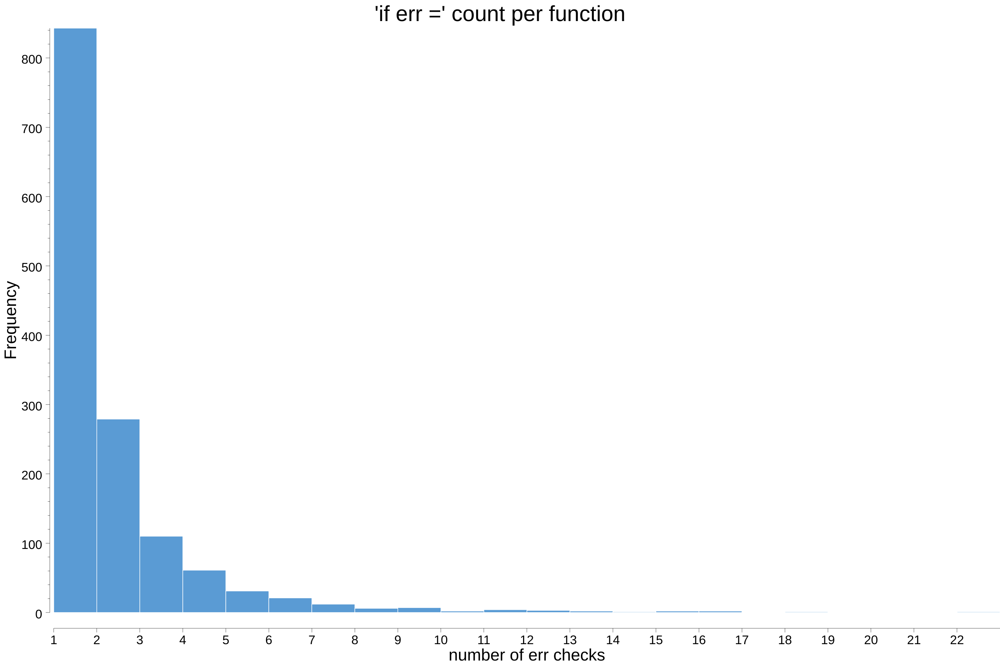

# errfreq

This tool takes Go package as an input and counts number of `if err !=` checks in the code per function.

Output is either raw numbers (for analysis/plotting in other software) or a histogram plot in PNG format.



## Install

```
go get github.com/divan/errfreq
```

## Usage

```
errfreq std
errfreq -raw std
errfreq -zeros std
```

By default it'll create PNG with histogram and open it.

## Notes

It currently fails if buggy packages are being analyzed - seems like default behaviour of packages.Load.
